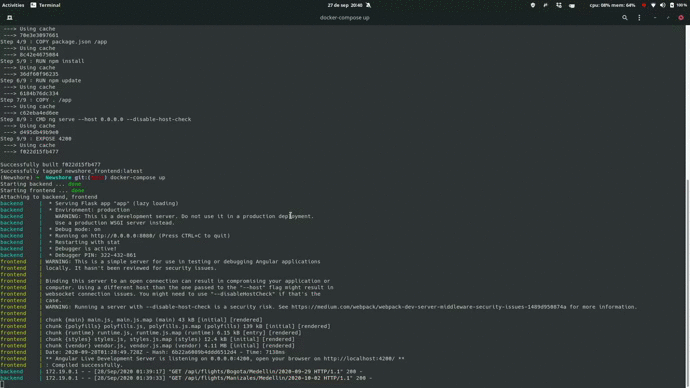

# Flights

In order to run our application, we need to follow the next instructions:

1. Install docker
2. Build our applications with the code line:
  ```bash
  docker-compose build
  ```
  followed by the line:
  ```bash
  docker-compose up
  ```
 
You will see something like this:

```bash
(Newshore) ➜  Newshore git:(main) docker-compose up   
Starting backend ... done
Starting frontend ... done
Attaching to backend, frontend
backend     |  * Serving Flask app "app" (lazy loading)
backend     |  * Environment: production
backend     |    WARNING: This is a development server. Do not use it in a production deployment.
backend     |    Use a production WSGI server instead.
backend     |  * Debug mode: on
backend     |  * Running on http://0.0.0.0:8080/ (Press CTRL+C to quit)
backend     |  * Restarting with stat
backend     |  * Debugger is active!
backend     |  * Debugger PIN: 322-432-861
frontend    | WARNING: This is a simple server for use in testing or debugging Angular applications
frontend    | locally. It hasn't been reviewed for security issues.
frontend    | 
frontend    | Binding this server to an open connection can result in compromising your application or
frontend    | computer. Using a different host than the one passed to the "--host" flag might result in
frontend    | websocket connection issues. You might need to use "--disableHostCheck" if that's the
frontend    | case.
frontend    | WARNING: Running a server with --disable-host-check is a security risk. See https://medium.com/webpack/webpack-dev-server-middleware-security-issues-1489d950874a for more information.
frontend    | 
frontend    | chunk {main} main.js, main.js.map (main) 43 kB [initial] [rendered]
frontend    | chunk {polyfills} polyfills.js, polyfills.js.map (polyfills) 139 kB [initial] [rendered]
frontend    | chunk {runtime} runtime.js, runtime.js.map (runtime) 6.15 kB [entry] [rendered]
frontend    | chunk {styles} styles.js, styles.js.map (styles) 12.4 kB [initial] [rendered]
frontend    | chunk {vendor} vendor.js, vendor.js.map (vendor) 4.11 MB [initial] [rendered]
frontend    | Date: 2020-09-28T01:28:49.728Z - Hash: 6b22a6089b4ddd6512d4 - Time: 7138ms
frontend    | ** Angular Live Development Server is listening on 0.0.0.0:4200, open your browser on http://localhost:4200/ **
frontend    | : Compiled successfully.
```

Our application will run in the endpints:
- Backend: http://0.0.0.0:8080/
- Frontend: http://localhost:4200/

Here is a demo gif with the app running into the container:


